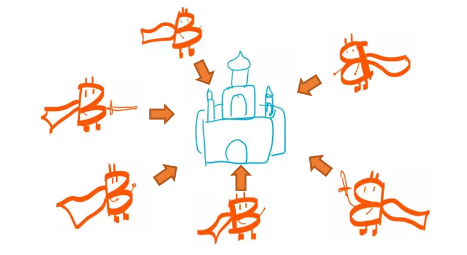
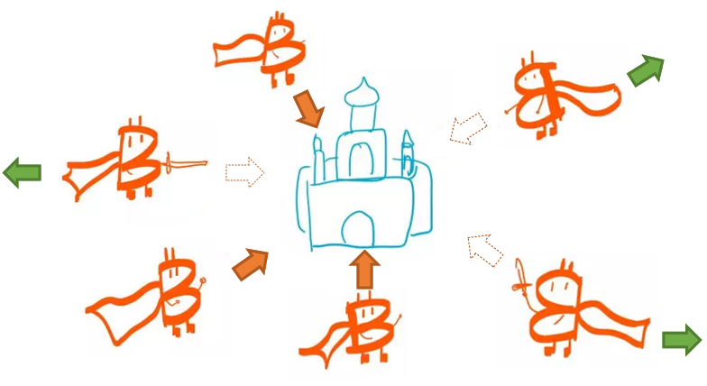
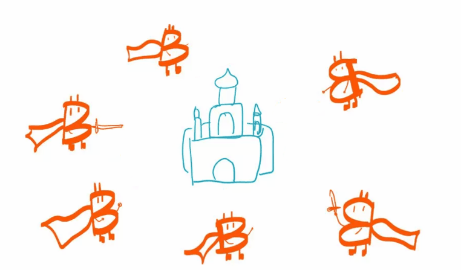
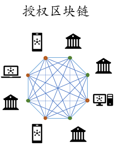
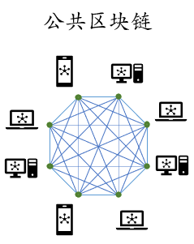

读书提示：本书[发布在此](https://book.uchaindb.com/)，具有更好的阅读体验。

# 重要基础概念

区块链系统中有许多零碎的基础概念，它们是组成区块链生态的重要部分。这里面每个概念扩展开来，都能变成一本书的长度，鉴于本书是以实践为主，在后续的章节里，我们会使用具体编程实践的方式，去更加深入的理解每一个概念，这里只做简要讲解，方便读者在未完全掌握具体知识前，有一个初步的大体框架性概念。

## 软分叉、硬分叉

区块链是一条链状，通过一条链将许多区块锁定在这个区块链上，然而因为多种理由，可能是人为的修改共识，也可能是正常共识阶段临时产生的不同步型分叉，使得一条链在某个分叉点后分成互相没有交集的两条链

在比特币的百科上有这样的描述：

- 硬分叉是在修改区块链协议后，使得在老客户端里面认为无效的区块或者交易，在新客户端当中认为是有效的。
- 软分叉是在修改区块链协议后，使得在老客户端里面认为有效的区块或者交易，在新客户端当中变得无效了。

这个基本定义比较绕口，形成一张表格如下：

|        | 老客户端                     | 新客户端                             |
| ---    | ---                          | ---                                  |
| 硬分叉 | 识别新客户端产生的区块为无效 | 将产生老客户端无法识别的新区块       |
| 软分叉 | 识别新客户端产生的区块为有效 | 可能会将老客户端产生的区块识别为无效 |

### 硬分叉

硬分叉是对协议的修改，启用了新的交易或区块格式，使得老客户端无法识别，因此要求所有客户端都要升级。通常情况下，对区块的结构、难度，共识的规则，或者改变有效的交易类型，都会产生硬分叉。但不是所有新增交易类型都必须使用硬分叉，也可以定义一种特殊的交易，使其对老客户端来看是有效交易（但其实无法真实的识别的交易），来增加新的交易种类。

硬分叉通常都是有意而为之的，通常都是由区块链的开发者煽动的，其通常情况会有两种结果。

- 第一种结果：一大批节点都不支持新的共识规则，继续使用以前老的共识（通常是老客户端）运作，
  这时候也有一定数量的节点开始使用新的共识规则（通常是新客户端）。
  那这个时候，两边不同的共识都会拒绝对方共识产生的区块，使得他们分裂成为两种不同的区块链（加密货币）。
  
- 第二种结果：大部分节点都同意更改共识规则，迫使使用老共识规则的节点，
  不得不改变他们的共识规则，改变成新共识规则，最终由所有节点共同产生一条新的区块链。
  

#### 案例

以下是以太坊的硬分叉案例：

因其每次更新都是通过硬分叉的方式实现的，但是没有分裂，所以看起来都是一条线的，
而其实际是淘汰了老共识，仅有一次ETC的分裂，是由于社区的不一致意见，最终分裂为两种不同的货币。

以下是比特币的分叉案例：

与以太坊不同，比特币本身从来没有进行过硬分叉，
所以每一次硬分叉其实都是比特币的竞争币在主动从比特币分裂出去的硬分叉，
这时候其实老共识依旧被称之为原货币。

### 软分叉

软分叉是对协议的修改，使得老客户端可以将新的区块识别为合法的区块，所以说软分叉是向后兼容的。新的交易类型经常是以软分叉的方式添加进来，它只需要发送者和接收者以及对应的新客户端能够识别新的交易类型即可。在过去，P2SH和隔离见证都是通过这种方式添加到比特币当中的。

软分叉不需要所有节点都升级，就可以保持共识，因为由新客户端产生的所有区块，也都是符合老规则的，因此老客户端是可以接受这些区块的。

注意，网络上流传着另外一种解释，即软分叉的老客户端依旧可以产生新客户端可以识别的区块，以此使得老客户端能够在一段时间内不升级，这个说法不完全正确，因为老客户端无法识别新客户端新添加的功能，当然也无法将含有新功能的新交易或区块正确的打包，即有可能打包出老客户端认为是有效的区块，但是新客户端认为是无效的区块，长期来看，老客户端产生的区块可能会被新客户端拒绝而丧失获取奖励的机会。

举例来说，2017年8月启用的隔离见证功能，因为修改交易的结构，使得老客户端虽然能继续识别其新的数据结构，但没有对应的逻辑对新的交易进行验证，便可能出现将无效的交易当作有效的交易进行打包，并执行挖矿操作，但该区块广播到新客户端后，由于新客户端可以对新的交易进行验证，并发现其不合法，便拒绝该区块，使得老客户端辛苦的挖矿操作变得无意义。

因此在软分叉发生后，是有可能产生如下图所示的情况，即新老客户端均能产生互相识别为合法的区块，但随着该次分叉修改的程度高低，出现该种情况的几率呈负增长。

## 拜占庭将军问题

拜占庭将军问题（Byzantine Generals Problem）是区块链中为达成共识的基础问题，
其故事有多个版本，其中一个可以这样说：

拜占庭位于如今的土耳其的伊斯坦布尔，是东罗马帝国的首都。
由于当时拜占庭罗马帝国国土辽阔，为了防御目的，因此每个军队都分隔很远，将军与将军之间只能靠信差传消息。
在战争的时候，拜占庭军队内所有将军和副官必须达成一致的共识，决定是否有赢的机会才去攻打敌人的阵营。
但是，在军队内有可能存有叛徒和敌军的间谍，左右将军们的决定又扰乱整体军队的秩序。
在进行共识时，结果并不代表大多数人的意见。
这时候，在已知有成员谋反的情况下，其余忠诚的将军在不受叛徒的影响下如何达成一致的协议，拜占庭问题就此形成。

<table>
<tr>
<td>

</td>
<td>

</td>
</tr>
</table>

图示：未达成共识的进攻计划会导致战争的失败。

在拜占庭问题里，最重要的事情是：所有将军如何能够达成共识。

转换到现代信息系统的问题就是：如何在不可信的通信通道和有叛徒节点的情况下达成共识。

在科学家们深入研究后，科学家们得出一个结论：如果叛徒的数量大于或等于1/3，拜占庭问题不可解。

比特币对此的解决方法，用形象的方式来描述，就是做一道非常难的数学题，来证明工作量，而这个工作量证明就增加了发送信息的成本，降低节点发送消息速率，这样就以保证在一个时间只有一个节点(或是很少)在进行广播，同时在广播时会附上自己的签名确保没有人可以伪造。

这个过程就像一位将军A在向其他的将军（B、C、D…）发起一个进攻提议一样，将军B、C、D…看到将军A签过名的进攻提议书，如果是诚实的将军就会立刻同意进攻提议，而不会发起自己新的进攻提议。

如上图的例子中，他们分别进行了以下步骤：

* 所有成员都同时开始做一道很难的数学题目；
* 其中有一位成员由于出色的计算能力，率先完成了题目；
* 其他成员验算他的结果，并表示同意；
* 如果有成员不同意，那他在表达不同意的同时，还必须计算另外一道不同的，依旧很难的数学题目；

这个步骤其实就是著名的工作量证明。

工作量证明其实相当于提高了做叛徒（发布虚假区块）的成本，在工作量证明下，
只有第一个完成证明的节点才能广播区块，竞争难度非常大，需要很高的算力，
如果不成功其算力就白白的耗费了（算力是需要成本的），如果有这样的算力作为诚实的节点，
同样也可以获得很大的收益（这就是矿工所作的工作），这也实际就不会有做叛徒的动机，整个系统也因此而更稳定。

## 授权区块链

授权区块链也常被称之为私有区块链（私链）、联盟区块链、混合区块链。与之相对的是无授权区块链，也称公共区块链，比特币、以太坊等一系列区块链便属于此种。

授权区块链使用访问控制层来管理区块链网络的访问权限。与公共区块链的网络相比，在授权区块链网络里的验证节点是由网络管理员审查并授予权限的，并不需要依赖任何一个匿名的节点来验证交易，因此授权区块链也并不能从网络效应（即随着匿名节点的增加，网络更加的稳定）中受益。在企业系统中，会更多的使用授权区块链。

其对比如下：

|            | 授权区块链             | 公共区块链                   |
| ---        | ---                    | ---                          |
| 如何接入   | 授权接入               | 开放接入                     |
| 法律与监管 | 可以符合法律及监管要求 | 目标就是创建一个反监管的网络 |
| 如何做验证 | 由预选出的受信节点验证 | 匿名，完全分布式验证         |
| 用途       | 企业级系统             | 完全公开的应用               |
| 案例       | 超级账本、EOS          | 比特币、以太坊               |

如下图，绿色的表示记账节点，而红色的是匿名的成员节点，在公共区块链中，
所有节点都可以是绿色的记账节点，但在授权区块链中，仅有通过授权的指定节点可以成为记账节点，
其他成员节点只能发起或接受事务。

<table>
<tr>
<td>

</td>
<td>

</td>
</tr>
</table>

