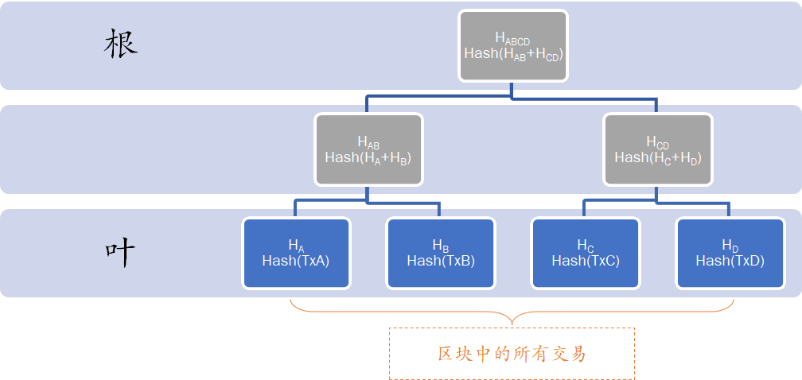
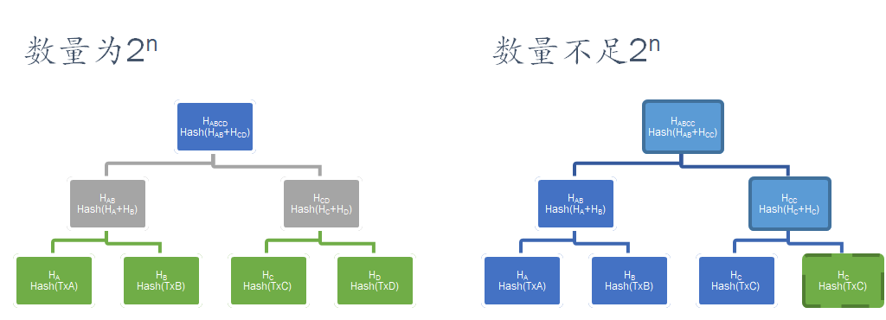
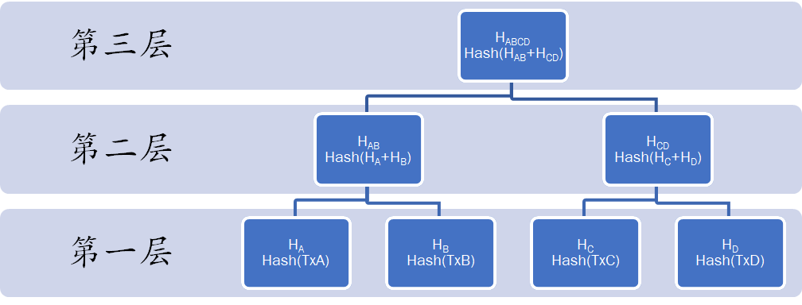

读书提示：本书[发布在此](https://book.uchaindb.com/)，具有更好的阅读体验。

# 哈希树

在密码学及计算机科学中，哈希树（hash tree）是一种树形数据结构，
每个叶节点均以数据块的哈希作为标签，而除了叶节点以外的节点则以其子节点标签的哈希结果作为标签。
哈希树能够高效、安全地验证大型数据结构的内容。
哈希树的概念由拉尔夫·默克尔（Ralph Merkle）于 1979 年申请专利，故亦称默克尔树（Merkle Tree）。
也常用在对等网络中，用于验证在计算机之间的存储、处理和传输的数据，
以确保其从对等网络中接受到的数据未受损或被修改，甚至可以检查数据是否受到篡改。

## 基础

在比特币的区块头中，便包含有默克尔根（Merkle Root）这一元素，
该元素的值便是选取的如下图所示的哈希树的根节点。



比特币中的哈希树有以下特点：

- 它是数据结构意义上的一种树，且是二叉树，即每个节点最多两个子节点；
- 每个节点均以哈希值输出，其哈希值的计算来源于其子节点的值；
- 只有叶子节点才是一笔交易的哈希值；
- 任意叶子节点的哈希值改变，均会导致根节点的哈希值改变，
  因此可被用作高效、安全地验证大型数据内容的一种数据结构；
- 验证一笔交易是否存在于该哈希树中，只需要树高度（即从叶子节点到根节点的节点数目）
  加一个节点的哈希值即可，且因为树高度呈对数增长（即增长缓慢），
  一个拥有10万节点的哈希树，高度也只有17，故只需少量数据便可验证一笔交易是否存在于该哈希树中，
  具体实现会在下一节中详解；

以下是节点的基本定义（既可能是叶子节点，也可能是根节点或中间的任意节点）。

```cs
internal class MerkleTreeNode  
{  
    // 以哈希值初始化节点，节点存储的核心数据就是这个哈希值；
    public MerkleTreeNode(UInt256 hash)  
    {  
        this.Hash = hash;  
    }  
  
    public UInt256 Hash { get; } // 哈希值的内部存储属性；
    // 该节点的左右节点，对于叶子节点，该两个属性应为空；
    public MerkleTreeNode Left { get; }  
    public MerkleTreeNode Right { get; }  
 }  
```
<!-- code:ClassicBlockChain/Entity/MerkleTreeNode.cs -->

## 创建哈希树

先通过一个示例来模拟哈希树的创建过程，如下图左。

- 第一步，准备所有叶子节点数据，如图所示，假设该区块中有TxA、TxB、TxC、TxD四个交易，
  分别计算每个交易的哈希值，并将对应的哈希值$H_{A}$、$H_{B}$、$H_{C}$、$H_{D}$填入叶子节点；
- 第二步，将叶子节点两两成对作为左右节点，并产生对应的父节点，如图所示，
  分别以$H_{A}$、$H_{B}$、$H_{C}$、$H_{D}$作为基础，计算出对应的父节点哈希值$H_{AB}$、$H_{CD}$并填入该节点；
- 第三步，将第二步反复执行，直到仅剩下一个节点为止；
- 第四步，最后仅剩下的唯一节点，便是哈希树的根节点，将其哈希值填入区块头，
  作为区块链验证数据正确性的证明材料，如图所示，最终我们获得了根节点$H_{ABCD}$；



若区块中交易数量恰好无法使得哈希树达到满二叉树
（即除最后一层叶子节点无任何子节点外，每一层上的每个节点均有两个子节点的二叉树），
可以通过将最后一个交易复制多次的方式补足二叉树，如上图右所示，在仅有三个交易的情况下，
TxC被重复的出现在最后两个叶子节点中。

为了后续更加容易的构建树形结构，我们对节点类进行功能扩展，
扩展一个新的构造函数和父节点的引用，方便做回溯操作。

```cs
internal class MerkleTreeNode  
{  
    // 通过已经构建完成的左右节点和可选的父节点组成新的节点，并且为左右子节点设置其父节点属性；
    public MerkleTreeNode(MerkleTreeNode left, MerkleTreeNode right, MerkleTreeNode parent = null)  
    {  
        this.Left = left;  
        this.Left.Parent = this;  
        this.Right = right;  
        if (this.Right != null) this.Right.Parent = this;  
        this.Parent = parent;  
        // 通过左右节点的哈希值，算出该节点的哈希值，并在右节点为空时，
        // 使用左节点代替计算哈希值，当哈希树无法达到满二叉树的时候，该情况便会出现；
        this.Hash = new Hash(new byte[][] { left.Hash, (right ?? left).Hash });  
    }  
    public MerkleTreeNode Parent { get; private set; } // 父节点的属性；
}  
```
<!-- code:ClassicBlockChain/Entity/MerkleTreeNode.cs -->

以下是创建哈希树的方法，注意该代码是递归执行，其执行顺序如下图所示，
递归层数和节点数目应根据实际传入的节点数目有所变化，下图为节点数为4时的情况。



```cs
// 该方法通过输入一系列的仅含有哈希值的叶子节点，输出构造完成的哈希树的根节点，
// 可以根据后续处理需求，对该树进行遍历、取根哈希或剪枝以备检验；
private static MerkleTreeNode BuildTree(MerkleTreeNode[] leaves)  
{  
    // 当仅有一个节点时，直接返回该节点，无需继续创建子树；
    if (leaves.Length == 1) return leaves[0];  
    // 代码中使用代码技巧避免了Math.Ceiling函数的调用；
    var parentNumber = (leaves.Length + 1) / 2;  
    // 初始化父节点数组；
    var parents = new MerkleTreeNode[parentNumber];  
    // 以父节点为依据进行遍历；
    for (int i = 0; i < parents.Length; i++)  
    {  
        // 从叶子节点中选出适合该父节点的左子节点；
        var left = leaves[i * 2];  
        // 当右子节点存在时赋值，否则设为空；
        var right = i * 2 + 1 < leaves.Length ? leaves[i * 2 + 1] : null;  
        // 根据左右子节点构造出父节点，其哈希值会在该类的构造函数中自动根据左右子节点的哈希值进行计算；
        parents[i] = new MerkleTreeNode(left, right);  
    }  
  
    // 进入下一轮的递归，将本层的父节点作为下一层的子节点重复以上过程；
    return BuildTree(parents);  
}  
```
<!-- code:ClassicBlockChain/Entity/MerkleTreeNode.cs -->

其中，计算该层节点的父节点的数目`parentNumber`的计算方法：$父节点数目= \left\lceil 子节点数目/2 \right\rceil$

以下是哈希树类，用来装载与哈希树相关的运算和信息。该类会在本节后续部分不断根据功能被扩充。

```cs
public class MerkleTree  
{  
    private MerkleTreeNode root; // 存储哈希树的根节点；
    // 哈希树的构造函数，输入一系列的哈希值，这些哈希值应该是由交易信息计算产生的；
    public MerkleTree(UInt256[] hashes)  
    {  
        // 使用前面才介绍过的创建哈希树的方法，将输入的哈希值构造一颗哈希树，并将其根节点存下；
        this.root = BuildTree(hashes.Select(p => new MerkleTreeNode(p)).ToArray());  
    }  
}  
```
<!-- code:ClassicBlockChain/Entity/MerkleTreeNode.cs -->

